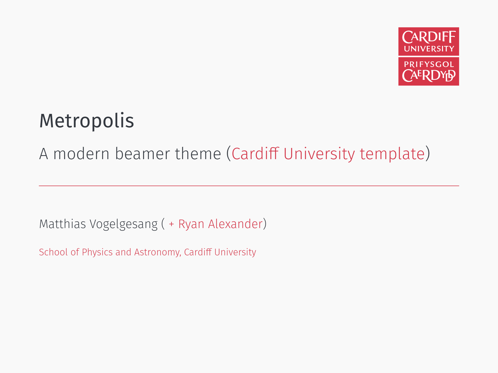

# Cardiff-University-Metropolis-Beamer-LaTeX-Template
A template for Cardiff University Beamer LaTeX presentations, based on the Metropolis theme.

## Dependencies:
[Metropolis Beamer theme](https://github.com/matze/mtheme) 
[Cardiff University logo PDF](https://github.com/RyanAPhys/Cardiff-University-Metropolis-Beamer-LaTeX-Template/raw/main/Cardiff_University_(logo).pdf)

## Usage:
Once you've got Metropolis installed (it's included in [Overleaf](https://overleaf.com)), simply put the [Template.tex](https://github.com/RyanAPhys/Cardiff-University-Metropolis-Beamer-LaTeX-Template/blob/4663bedc0fb2f0e58dd346f65c680c5c21713c3c/Template.tex) and the [logo PDF](https://github.com/RyanAPhys/Cardiff-University-Metropolis-Beamer-LaTeX-Template/blob/4663bedc0fb2f0e58dd346f65c680c5c21713c3c/Cardiff_University_(logo).pdf) in the same directory and then carry on as detailed in the Metropolis [manual](https://mirror.ox.ac.uk/sites/ctan.org/macros/latex/contrib/beamer-contrib/themes/metropolis/doc/metropolistheme.pdf).

## Template:
See full template [here](https://github.com/RyanAPhys/Cardiff-University-Metropolis-Beamer-LaTeX-Template/blob/dff2fa52fcab595743b106e0464577319245bd3f/Cardiff_University_Metropolis_Beamer_Theme.pdf). 

